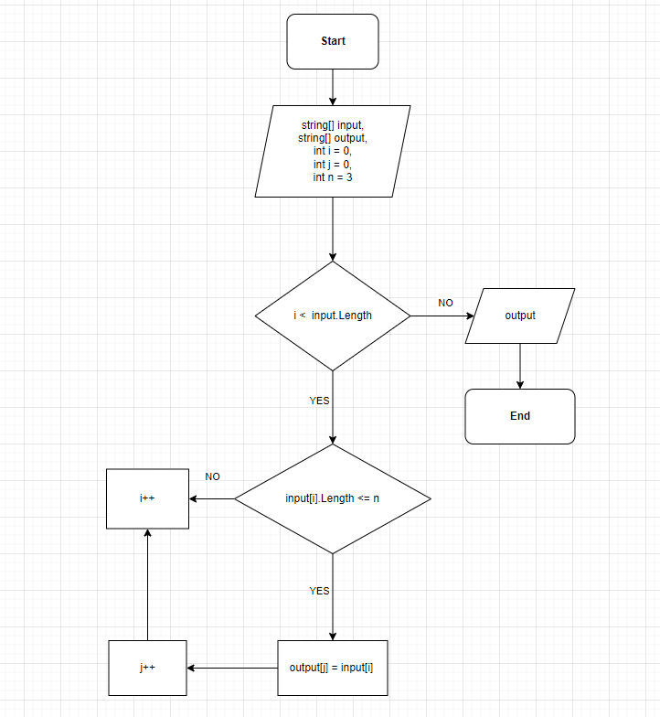

# Итоговая контрольная работа

*Задача*: Написать программу, которая из имеющегося массива строк формирует новый массив из строк, длина которых меньше, либо равна 3 символам. Первоначальный массив можно ввести с клавиатуры, либо задать на старте выполнения алгоритма. При решении не рекомендуется пользоваться коллекциями, лучше обойтись исключительно массивами.

## Блок-схема проекта

## Ход выполнения работы:

1. Ввод массива:

Программа начинает работу с запроса массива у пользователя функцией AskArray(). Пользователю необходимо ввести данные через пробел.

2.  Фильтрация массива:

Функция FindLessThan используется для создания нового массива Output, который заполняется элементами из исходного массива, длинна которых не превышает указанное число n.

В процессе цикла for каждая строка исходного массива проверяется на соответствие условию длины, и если условие выполняется, эта строка добавляется в новый массив.

3.  Вывод результата:

Используется функция WriteLine для вывода отфильтрованного массива result на экран. Для удобного форматирования строк применяется string.Join.

4.  Подсчет количества строк:

Для повышения эффективности кода вводится функция CountLessThan, которая подсчитывает количество строк в исходном массиве, длина которых меньше или равна числу n. Полученное число используется для определения размера нового массива output.

5.  Ввод значений:

Для удобства ввода значений, функция AskArray предлагает пользователю ввести значения через пробел, а затем разбивает их на отдельные элементы массива.

6.  Обработка ошибок и проверки ввода:

Внесены дополнительные проверки для обработки пустого ввода и использования пробела в качестве разделителя строк. Также добавлена обработка исключений для обеспечения более надежного ввода данных.

>> Запуск программы:

1. Чтобы запустить программу, перейдите в папку Final, затем выберите файл Program.cs, и выполните команду через терминал.
    
 >>>  dotnet run

2. Далее необходимо ввести значения, например:

 >>>>  [Hello 2 world :-)]

3. Пример вывода программы выглядит так:

>>>> [ 2, :-)]